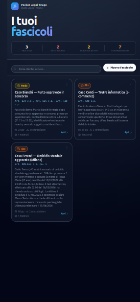
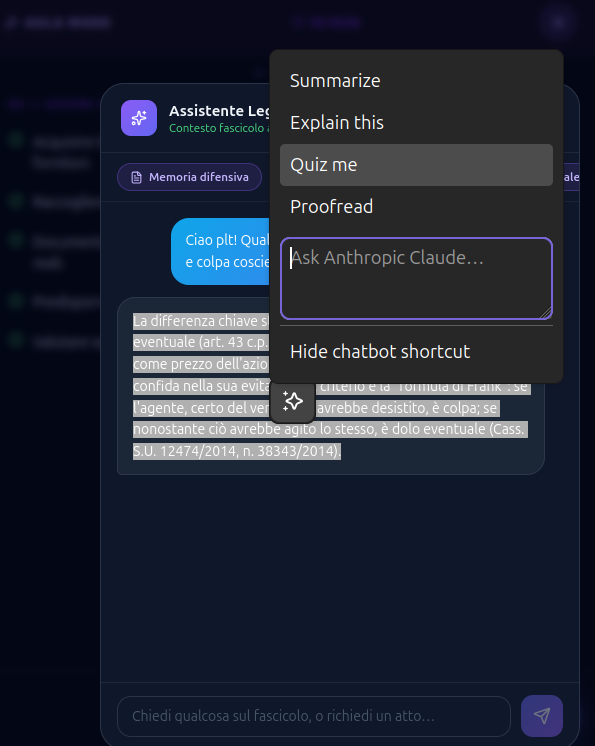
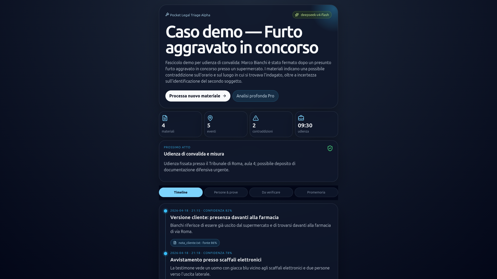
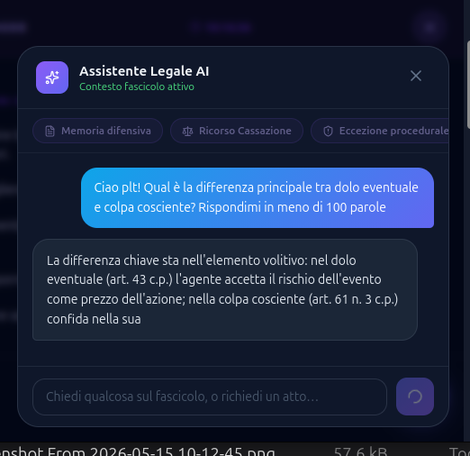

# ⚖️ Pocket Legal Triage

> **Mobile-first criminal-defense case triage. Turn legal chaos into a clean case file.**


Pocket Legal Triage (PLT) is a product for Italian criminal-defense lawyers who need to turn messy inputs — PDFs, scans, voice notes, court orders, police reports, client messages — into a **source-linked**, **deadline-aware**, **court-ready** case file.

It is **not** an “AI lawyer.”  
It is a mobile case-control system for the lawyer who remains fully in charge.

---

## ✨ Alpha preview

<p align="center">
  
  
</p>

<p align="center">
  
</p>

<p align="center">
  
</p>

---

## 🎯 Product thesis

Criminal defense work is not clean. It is:

- 📄 document dumps;
- 🧾 contradictory police reports;
- 🎙️ client voice notes;
- ⏳ procedural deadlines;
- 🧑‍⚖️ hearings that arrive too soon;
- 🧠 legal strategy under pressure.

PLT’s job is to convert that chaos into structured case state:

- 🧭 factual timeline;
- ⏰ procedural timeline and deadline candidates;
- 🧑‍🤝‍🧑 people, entities, witnesses, and roles;
- 🔎 evidence map with source quotes;
- ⚠️ contradictions and missing information;
- 📝 consultation briefs, hearing summaries, and draft acts;
- 💬 case-aware AI assistant as a command layer — not the whole product.

---

## 🚀 Current status

**Working alpha PWA** in [`alpha-pwa/`](./alpha-pwa/).

The alpha currently includes:

- 🗂️ **Three fictional demo cases**
  - furto aggravato in concorso;
  - truffa online;
  - omicidio stradale aggravato.
- 📱 **Mobile-first dashboard** with risk, deadlines, contradictions, and case cards.
- 📚 **Case detail workspace** with timeline, scadenze, facts, legal analysis, open questions, and memoria.
- 🧑‍⚖️ **Aula Mode** for hearing-day review.
- 🤖 **AI legal assistant** with case context injection.
- ✍️ **Draft generation shortcuts** for memoria difensiva, ricorso Cassazione, eccezione procedurale, controesame schema, and strategic analysis.
- ✅ **Task tracking** persisted in localStorage.
- 📤 **Brief export** via clipboard / Web Share API.

---

## 🧪 Run the alpha

```bash
cd alpha-pwa/backend
python3 -m venv .venv
source .venv/bin/activate
pip install -r requirements.txt

# Optional but needed for AI calls
export DEEPSEEK_API_KEY=sk-...
# or
export ANTHROPIC_API_KEY=sk-ant-...

uvicorn app.main:app --reload --port 8000
```

In another terminal:

```bash
cd alpha-pwa/frontend
npm install
npm run dev
```

Open:

- Frontend: <http://localhost:5173>
- Backend API: <http://localhost:8000>

---

## 🧠 Model strategy

| Workload | Default | Premium / fallback |
|---|---|---|
| Bulk extraction, chat, drafting | DeepSeek V4 Flash | Claude Haiku fallback |
| Deep legal reasoning, contradiction analysis | DeepSeek V4 Pro | Claude Opus fallback |
| OCR / document ingestion | Adapter layer | Provider-swappable |

DeepSeek is the cost-conscious default. Claude remains supported as a fallback through the same backend provider-routing layer.

---

## 🗺️ Workspace map

```text
alpha-pwa/          Working alpha PWA: FastAPI + React/Vite
00-context/         Session handoff notes and open questions
01-product/         Product spec, UX flows, feature map
02-research/        Market, model, OCR, legal-tech research
03-business/        Pricing, unit economics, GTM
04-technical/       Architecture, data model, model routing
05-validation/      Interview scripts and validation experiments
06-brand/           Positioning and landing-page copy
07-prompts/         System prompts, extraction prompts, evals
AGENT.md            Instructions for AI agents working in this repo
SOUL.md             Product ethos and non-negotiables
```

---

## 🛡️ Non-negotiables

- Do **not** frame PLT as an “AI lawyer.”
- Keep the lawyer in control: outputs are drafts, not decisions.
- Source-link every factual claim to a document quote, page/chunk, timestamp, and confidence score.
- Keep deadline candidates visibly unconfirmed until a lawyer verifies them.
- Build workflow first; chat is only the command layer.
- Validate with real lawyers before adding too much machinery.

---

## 💶 Pricing hypothesis

- **Starter:** €29/mo — solo lawyer, light monthly usage.
- **Pro:** €79–99/mo — active criminal-defense practice.
- **Firm:** €199–299/mo — shared workspace, multiple users, higher usage.
- **Case/discovery packs:** for large matters with heavy OCR/audio/document processing.

---

## 🧭 Positioning

Use:

> **Mobile-first criminal-defense case triage.**

Or:

> **From discovery dump to court-ready brief.**

Avoid:

> “AI lawyer.”

Wrong product. Wrong liability. Bad vibes.
