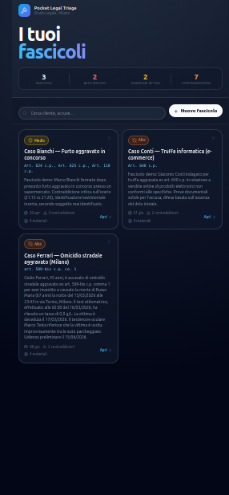
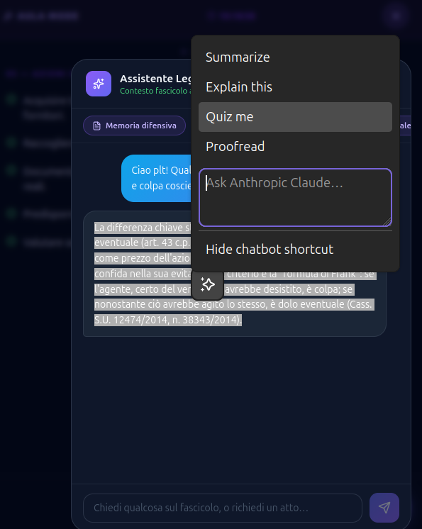
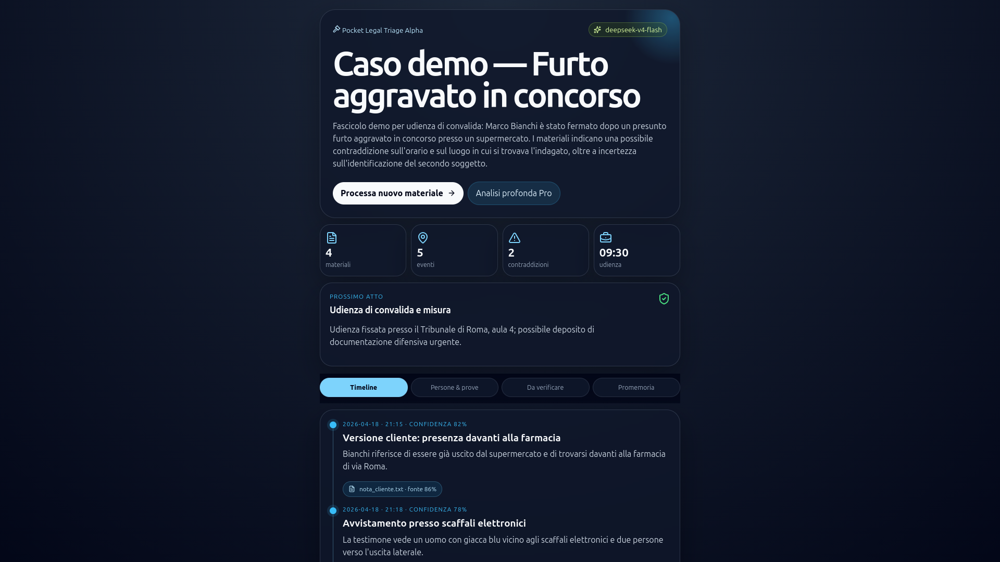
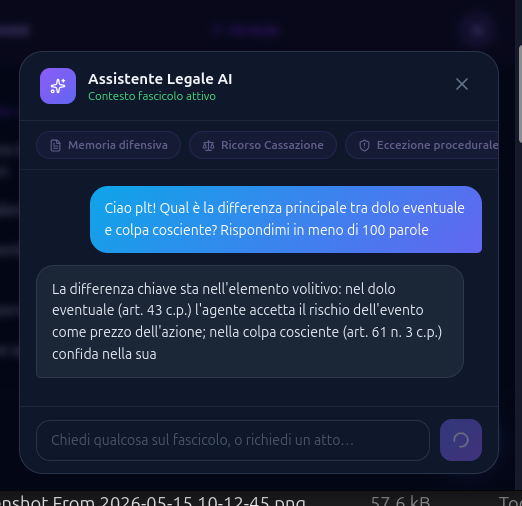

# ⚖️ Pocket Legal Triage — Alpha PWA

> **Italian criminal-defense case triage in a mobile-first dark-mode workspace.**


**Pocket Legal Triage (PLT)** is a mobile-first PWA for Italian criminal-defense lawyers. It takes raw case materials — documents, notes, transcripts — and turns them into a structured triage workspace: timeline, deadlines, contradictions, witness assessments, defense strategies, and a draft brief, all with source references back to the original documents.

The product is **not** an AI lawyer. It is a case triage cockpit — the lawyer stays in control, the AI does the structuring work.

### Branch and deploy

We work on `main`. Push to `main` triggers an automatic Netlify deploy of the frontend.

| Layer | Service | URL |
|---|---|---|
| Frontend | Netlify | `pocket-legal-triage.netlify.app` |
| Backend | Render | `plt-backend.onrender.com` |

---

## 📸 Screenshots

<p align="center">
  
  
</p>

<p align="center">
  
</p>

<p align="center">
  
</p>

---

## ✨ What is built

A working alpha with three fictional demo cases:

- **Caso Bianchi** — furto aggravato in concorso (Roma)
- **Caso Conti** — truffa online / e-commerce (Napoli)
- **Caso Ferrari** — omicidio stradale aggravato (Milano)

Core app surfaces:

- 🏠 **Homepage** — case list with live stats: risk level, active deadlines, contradictions, materials count.
- 📁 **Case detail** — 6-tab workspace: timeline, scadenze, fatti, analisi legale, domande aperte, memoria.
- ⚖️ **Legal analysis** — charge elements with proven/disputed/weak/missing status, defense strategies, constitutional issues, witness credibility scores, evidence balance.
- 🧑‍⚖️ **Aula Mode** — hearing-day full-screen overlay with 5-slide structure, keyboard/swipe navigation, live clock.
- 🤖 **AI chat** — floating case-aware assistant, streaming, full dossier injected as context, quick-action chips.
- ✍️ **Document drafting** — memoria difensiva, ricorso Cassazione, eccezione procedurale, schema controesame, analisi strategica.
- ✏️ **Inline editing** — every field (timeline, people, evidence, deadlines, legal analysis) is editable in place; changes persist in IndexedDB.
- 🔀 **AI merge** — re-analyze and merge new AI output non-destructively into existing edits.
- 🔒 **Sensitive data redaction** — define manual rules or auto-detect PII with AI; render-time only, IndexedDB never touched; global rules + per-case rules.
- 📄 **OCR upload** — drag-and-drop PDF/image upload; pypdf for native PDFs, Mistral OCR for scanned documents.
- ✅ **Task tracking** — procedural deadline tasks persisted in localStorage.
- 📤 **Brief export** — clipboard copy plus Web Share API; AI anonymization of brief text for sharing.

---

## 🧰 Local setup

### Requirements

- Python 3.11+
- Node 18+ and npm
- A DeepSeek or Anthropic API key for live AI calls

### Backend

```bash
cd alpha-pwa/backend

# Create and activate a virtual environment
# Required on Debian/Ubuntu because of externally-managed-environment protections.
python3 -m venv .venv
source .venv/bin/activate

# Install dependencies
pip install -r requirements.txt

# Option A: export a key for this shell
export DEEPSEEK_API_KEY=sk-...        # uses deepseek-v4-flash / deepseek-v4-pro
# or
export ANTHROPIC_API_KEY=sk-ant-...   # uses claude-haiku-4-5 / claude-opus-4-7

# Start the API
uvicorn app.main:app --reload --port 8000
```

Optional `.env` approach:

```bash
# alpha-pwa/backend/.env — do not commit
DEEPSEEK_API_KEY=sk-...
```

Then load it before starting uvicorn:

```bash
set -a
source .env
set +a
uvicorn app.main:app --reload --port 8000
```

### Frontend

```bash
cd alpha-pwa/frontend
npm install
npm run dev
```

Open **http://localhost:5173**. Vite proxies all `/api/*` requests to port `8000`.

---

## 🔀 Model routing

Default stack: **DeepSeek V4 Flash** for everything, **Mistral** for OCR on scanned files.

| Task | Model |
|---|---|
| Chat, analysis, redaction, anonymization | `deepseek-v4-flash` |
| Deep legal drafting (pro mode) | `deepseek-v4-pro` |
| OCR — native PDF | pypdf (local, free) |
| OCR — scanned PDF / image | Mistral OCR |

The backend auto-detects the provider from environment variables. Override model names via `.env`:

| Env var | Default |
|---|---|
| `DEEPSEEK_DEFAULT_MODEL` | `deepseek-v4-flash` |
| `DEEPSEEK_PRO_MODEL` | `deepseek-v4-pro` |
| `ANTHROPIC_API_KEY` | fallback if no DeepSeek key — uses `claude-haiku-4-5` / `claude-opus-4-7` |

If both `DEEPSEEK_API_KEY` and `ANTHROPIC_API_KEY` are set, DeepSeek takes priority.

---

## ✅ Running tests

Backend:

```bash
cd alpha-pwa/backend
source .venv/bin/activate
python -m pytest tests/ -v
```

Frontend type-check + production build:

```bash
cd alpha-pwa/frontend
npm run build
```

---

## 🧱 Key files

```text
backend/
  app/main.py          FastAPI routes: /api/cases, /api/chat, /api/analyze-text, /api/upload
  app/models.py        Pydantic data model: CaseAnalysis, LegalAnalysis, ChatRequest, ...
  app/demo_data.py     Three fictional Italian demo cases
  app/ai_service.py    Provider routing, streaming chat, case analysis
  app/ocr_adapter.py   OCR boundary / provider adapter
  tests/               Backend contract and demo-case tests

frontend/
  src/main.tsx         React app: types, components, App
  src/styles.css       Mobile-first dark theme
  vite.config.ts       Vite config with /api proxy to port 8000
```

---

## 🗂️ Demo case inventory

| Case ID | Name | Charge | Risk |
|---|---|---|---|
| `demo-furto-aggravato-roma-2026` | Caso Bianchi | Art. 624/625/110 c.p. — furto aggravato in concorso | Medium |
| `demo-frode-online-napoli-2026` | Caso Conti | Art. 640 c.p. — truffa online | High |
| `demo-omicidio-stradale-milano-2026` | Caso Ferrari | Art. 589-bis c.p. — omicidio stradale aggravato | High |

---

## 🧠 AI chat behavior

The assistant is prompted as an Italian criminal-defense support system with knowledge of:

- Codice Penale and relevant case law;
- Codice di Procedura Penale;
- Leggi speciali: Codice della Strada, T.U. Stupefacenti, d.lgs. 231/2001;
- Corte di Cassazione Penale jurisprudence;
- Corte EDU fair-trial principles.

When a case is open, the full dossier — charges, strategies, witnesses, contradictions, evidence balance, deadlines — is injected into the chat context.

---

## 🔍 OCR note

File upload currently supports the alpha contract and text extraction path. Dedicated OCR remains behind an adapter so the provider can be swapped without rewriting the product workflow.

The rule stays the same:

> Source or shut up. Every extracted claim needs a quote, source reference, and confidence score before it should be trusted.
